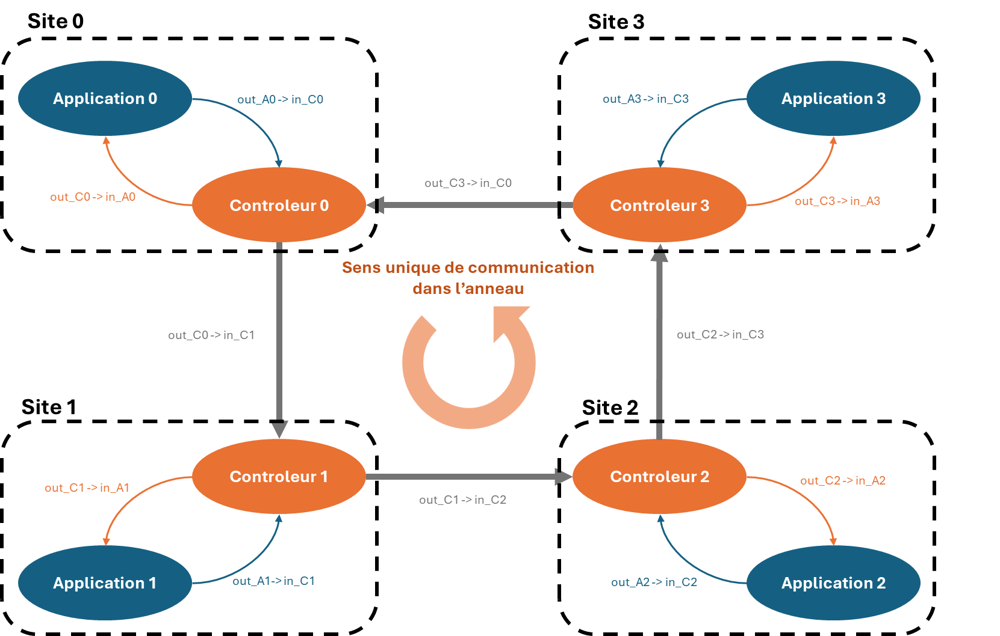
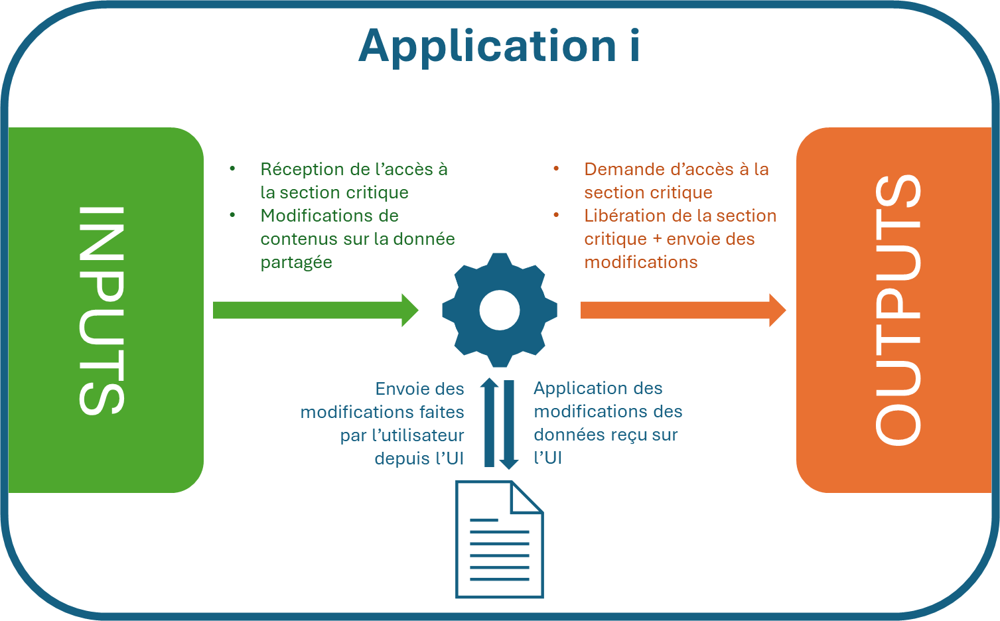

# Application répartie pour un système de traitement textuel décentralisé

Projet SR05 réalisé par (Groupe 12) : 
* Alexis Deseure--Charron
* Antoine Lequeux
* Jessica Devulder
* Timo Allais

## Description du projet

Ce projet a pour but de créer une application distribuée permettant de traiter un fichier texte de manière décentralisée. Cette application comporte des sites reliés en réseau (anneau) entre eux afin de se partager les modifications du fichier texte. L'implémentation de l'algorithme de la file d'attente répartie permet de gérer la concordance entre les différents sites.

## Exécution

Pour exécuter le projet, il faut avoir installé une version de Go supérieure à 1.18. Ensuite, il suffit d'exécuter le script `run.sh` :
```bash
./run.sh
```

Pour exécuter le projet avec des paramètres spécifiques, il faut exécuter le script `run.sh` avec les arguments suivants :

```bash
./run.sh <nombre_d_instances> <reinitialiser_anciennes_sauvegardes> <debug_mode>
```
 avec `<nombre_d_instances>` le nombre d'instances de l'application à exécuter, `<reinitialiser_anciennes_sauvegardes>` devant prendre la valeur `1` si l'on souhaite réinitialiser les anciennes sauvegardes (n'importe quelle autre valeur ou rien sinon) et `<debug_mode>` devant prendre la valeur `1` si l'on souhaite activer le mode débogage : sauvegarde manuelle avec un bouton (n'importe quelle autre valeur ou rien sinon).

 Si le fichier run.sh n'est pas reconnu, il peut être nécessaire d'exécuter 'dos2unix run.sh' pour le formatter correctement.

## Architecture

L'architecture de l'application est divisée en plusieurs couches :
- Couche applicative
- Couche de contrôle

Cette organisation permet de bien diviser et de distinguer les fonctionnalités applicatives des fonctionnalités de contrôle. En effet, ces deux couches constituent 2 programmes Go distincts qui interagissent entre eux via leurs entrées/sorties standards.

Pour lancer l'application en réseau, le script `run.sh` permet de créer un anneau unidirectionnel FIFO de taille `N` en définissant correctement les paramètres des sites ainsi que la liaison des entrées/sorties.

Pour cela, il s'assure de nommer correctement chaque élément d'un site `i` (attribuer l'id `i` à la fois au contrôleur et à l'application associée) et d'attribuer tous les id allant de 0 à N-1 (N étant le nombre de sites). 

Ce script permet aussi de créer les fichiers temporaires FIFO qui permettent la liaison des entrées/sorties ainsi qu'un *trap* pour correctement fermer tous les processus lancés par le programme en cas de `CTRL+C`.

Enfin, ce script permet de supprimer les anciens fichiers de sorties si l'option est activée et d'activer le mode debug sur l'ensemble des sites si l'option est activée.

En résumé, le schéma ci-dessous permet de représenter l'architecture globale du réseau et de notre projet dans le cas d'un anneau de 4 sites :



### Couche applicative

La couche applicative implémente une exclusion mutuelle pour distinguer les actions d'écriture et de lecture sur son entrée et sa sortie. Elle conserve un réplicat local de la donnée partagée qui est un fichier `.log` conservant l'historique des modifications permettant de reconstruire le fichier global partagé. 

Deux versions existent alors : 
* La version **debug** qui n'essaie jamais de modifier la donnée partagée et qui attend simplement le clic sur le bouton `save` pour demander l'accès à la section critique à son contrôleur.
* La version **classique** qui essaie de modifier la donnée partagée en demandant l'accès à la section critique dès qu'il y a eu une modification et que le délai s'est écoulé.

Quand l'application demande l'accès à la section critique (`MsgAppRequest`), l'utilisateur peut toujours continuer ses modifications et la partie visuelle n'est pas stockée localement dans un fichier. 

A la réception de l'accès à la section critique (`MsgAppStartSc`), l'application modifie son fichier local de log avec ses modifications en cours et envoie le contenu de la mise à jour à son contrôleur tout en libérant la section critique (`MsgAppRelease`).

Si l'application reçoit, du contrôleur, une ou plusieurs modifications du contenu de la donnée partagée (`MsgAppUpdate`), les modifications sont appliquées sur la copie locale du fichier partagé à partir de la dernière version à jour. De plus, l'UI qui affiche le texte à l'utilisateur est mise à jour en appliquant directement les modifications de la version reçu sur la version affichée (même si la version affichée ne correspond pas à la version locale sauvegardée, qui elle, correspond à la version sauvegardée localement par tous les sites).

Voici un résumé de l'architecture décrite ci-dessus d'une instance de l'application :



D'autres messages peuvent aussi être envoyés/reçus par l'application pour garantir les autres fonctionnalités (sauvegarde répartie datée, reprise de l'historique au lancement, fermeture d'une instance entraînant les autres):
* Message de réception de l'indication d'une fermeture de l'application (`MsgAppShallDie`): si l'utilisateur ferme une des fenêtres ouvertes, il faut toutes les fermer pour éviter des soucis de communication. Ce message, une fois reçu, entraîne la fermeture de la fenêtre *Fyne*. De même, l'application qui gère la fenêtre qui s'est fermée envoie un message à son contrôleur pour être transmis à tous les sites (`MsgAppDied`).
* Message de réception de modification du texte local pour l'initialisation (`MsgReturnNewText`): lors de l'initialisation, si des sites avaient des fichiers sauvegardés différents, celui qui a le plus de lignes est retenu et son contenu est envoyé à tous les sites. A la réception de ce message, l'application du site doit modifier son texte affiché ainsi que celui sauvegardé localement pour garantir la synchronisation globale entre les sites.
* Message d'envoi du nombre de lignes et du contenu (`MsgInitialSize` et `MsgInitialText`) : servent pour les mêmes raisons que le point précédent pour transmettre l'information au contrôleur
* Message d'envoi d'une demande de coupe au contrôleur pour initier la sauvegarde répartie datée (`MsgCut`)


### Couche de contrôle

La couche de contrôle a pour objectif de gérer les communications entre les sites en implémentant l'algorithme de la file d'attente répartie adapté à une topologie en anneau.

Pour cela, chaque site envoie son id (unique) à son successeur (anneau unidirectionnel à canaux FIFO) et traite puis transmet les messages qu'il n'a pas lui-même envoyé. Il arrête de transmettre les messages qu'il a lui même envoyé au moment où il les reçoit.

Lorsque le contrôleur reçoit un message de son application de demande de section critique (`MsgAppRequest`), il envoie un message (`MsgRequestSc`) à tous les autres sites pour indiquer cette demande via l'anneau (il le passe à son voisin qui le transmet également jusqu'à revenir à lui). Chaque contrôleur qui reçoit cette demande envoie également un accusé de réception sur l'anneau avec son horloge modifiée (`MsgReceiptSc`). Quand, d'après la logique de l'algorithme de la file d'attente répartie et le calcul des estampilles, l'horloge de la demande est inférieure à toutes les autres, alors le contrôleur peut accorder à son application l'accès à la section critique en lui envoyant un message (`MsgAppStartSc`).

De même, quand le contrôleur reçoit un message de libération de la section critique de son application (`MsgAppRelease`), il s'assure de transmettre, à tous les sites via l'anneau, un message qui contient les modifications de la donnée partagée (`MsgReleaseSc`). Chaque contrôleur recevant ce message transmet directement les modifications à son application en lui envoyant un message (`MsgAppUpdate`) pour qu'elle puisse mettre à jour la copie locale de la donnée partagée en utilisant ces modifications.

Voici un résumé de l'architecture décrite ci-dessus d'une instance d'un contrôleur :


D'autres messages peuvent aussi être envoyés/reçus par le contrôleur pour garantir les autres fonctionnalités (sauvegarde répartie datée, reprise de l'historique au lancement, fermeture d'une instance entraînant les autres):
* Message d'une demande de coupe reçu par l'application et transmise à tous les sites pour initier la sauvegarde répartie datée (`MsgCut`)
* Message de l'indication d'une fermeture de l'application : si l'utilisateur ferme une des fenêtres ouvertes, il faut toutes les fermer pour éviter des soucis de communication. Après réception d'un message par l'application (`MsgAppDied`), le contrôleur doit transmettre un message à toutes les autres applications via leurs controleurs respectifs (`MsgAppShallDie`).
* Messages liés à l'initialisation du système de mise en commun de la donnée partagée qui permettent de garantir que tous les sites possèdent la même copie locale de la donnée partagée (fichier `.log`) au début peu importe le nombre de sites qu'il y avait à l'exécution précédente et le nombre de sites qu'il y a à l'exécution actuelle :
    * `MsgReturnNewText` : message envoyé à l'application et contenant le nouveau texte
    * `MsgInitialSize` : message reçu de l'application contenant le nombre de lignes de son texte local 
    * `MsgInitialText` : message reçu de l'application contenant le texte local de l'application qui est ensuite sauvegardé localement dans le contrôleur
    * `MsgAcknowledgement` : message envoyé/reçu d'un contrôleur pour indiquer le nombre de ligne du fichier local de l'application aux autres contrôleurs
    * `MsgPropagateText` : message envoyé/reçu d'un controleur pour envoyer le texte de son application à tous les autres (celui qui a le fichier de `.log` localement avec le plus de lignes)
